# Finance App Overview

## Propósito do app

Este app Expo/React Native resolve um problema específico de finanças pessoais: transformar um orçamento mensal em um número simples de gasto diário e, depois, acompanhar como esse saldo evolui ao longo do mês com lançamentos de entrada, saída, gasto diário e economia. O fluxo principal é enxuto: o onboarding coleta uma estimativa mensal por categoria, cria a conta, registra o saldo inicial e leva o usuário para uma visão por dia/mês, onde ele navega pelos saldos e registra transações.

## Stack e decisões de arquitetura relevantes

- Plataforma: Expo 54, React 19, React Native 0.81 e TypeScript em modo `strict`.
- Gerenciador de pacotes observado: Bun, via `bun.lock`, embora os scripts do projeto também funcionem com a CLI padrão do Expo.
- Navegação: `expo-router` com file-based routing em `app/`, usando route groups para separar `/(auth)`, `/(onboarding)` e `/(tabs)`.
- Estado de servidor: `@tanstack/react-query` com `QueryClient` global no layout raiz; queries têm `staleTime` de 5 minutos e retry padrão de 2 tentativas.
- Estado local: `zustand`; token de autenticação persiste em `AsyncStorage`, enquanto estado de onboarding e mês selecionado ficam em memória.
- Camada HTTP: `axios` centralizado em `src/services/client.ts`, com `Authorization: Bearer` via interceptor e base URL vinda de `EXPO_PUBLIC_API_URL`.
- Organização: rotas ficam em `app/`; regra e integração ficam em `src/features/*`; componentes reutilizáveis ficam em `src/components/*`; utilitários compartilhados ficam em `src/lib/*`.
- Contrato com backend: tipos de API e tipos de domínio são separados; respostas são normalizadas por mappers antes de chegar nas telas.
- Validação: `zod` valida login/cadastro no cliente antes do envio.
- Styling/UI: `uniwind` + Tailwind CSS 4 + tokens em `global.css`; `HeroUINativeProvider` fornece provider, toast e primitives auxiliares.
- Tema visual: tipografia custom com fontes Inter/JetBrains Mono carregadas no bootstrap; paleta declarada como design tokens globais.
- Infra mobile: `react-native-gesture-handler`, `react-native-safe-area-context`, `react-native-reanimated` e `react-native-screens` sustentam gestos, layout seguro e animações.
- Estado offline/local DB: não há SQLite, sync offline ou event sourcing; a fonte de verdade é o backend HTTP.
- Deep link configurado com scheme `financeapp` em `app.json`.

## Status atual do plano em 2026-06-04

| Área | Estado |
| --- | --- |
| Onboarding, auth e saldos | Implementados. |
| Transações simples e recorrentes | Implementadas, incluindo scopes de edição/exclusão. |
| Tags | Implementadas na aba, detalhe, formulário e picker de transações. |
| Recuperação de senha | Implementada com telas e integração HTTP. |
| Totais | Pendente; a aba ainda renderiza placeholder. |
| Testes automatizados | Ainda ausentes. |

## Fluxo de cada tela em Mermaid

### Bootstrap e guarda de autenticação (`app/_layout.tsx`)

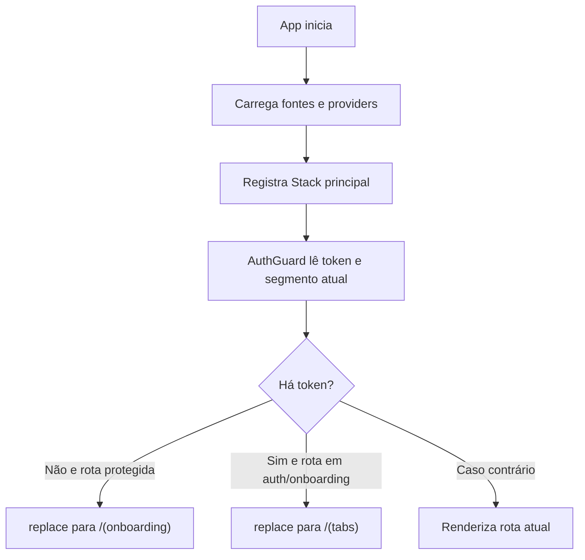
```mermaid
flowchart TD
  A["App inicia"] --> B["Carrega fontes e providers"]
  B --> C["Registra Stack principal"]
  C --> D["AuthGuard lê token e segmento atual"]
  D --> E{"Há token?"}
  E -->|Não e rota protegida| F["replace para /(onboarding)"]
  E -->|Sim e rota em auth/onboarding| G["replace para /(tabs)"]
  E -->|Caso contrário| H["Renderiza rota atual"]
```

### Boas-vindas (`app/(onboarding)/index.tsx`)

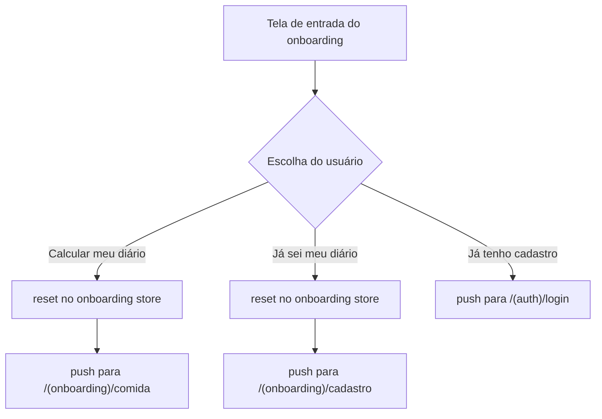
```mermaid
flowchart TD
  A["Tela de entrada do onboarding"] --> B{"Escolha do usuário"}
  B -->|Calcular meu diário| C["reset no onboarding store"]
  C --> D["push para /(onboarding)/comida"]
  B -->|Já sei meu diário| E["reset no onboarding store"]
  E --> F["push para /(onboarding)/cadastro"]
  B -->|Já tenho cadastro| G["push para /(auth)/login"]
```

### Passo de categoria (`app/(onboarding)/[step].tsx`)

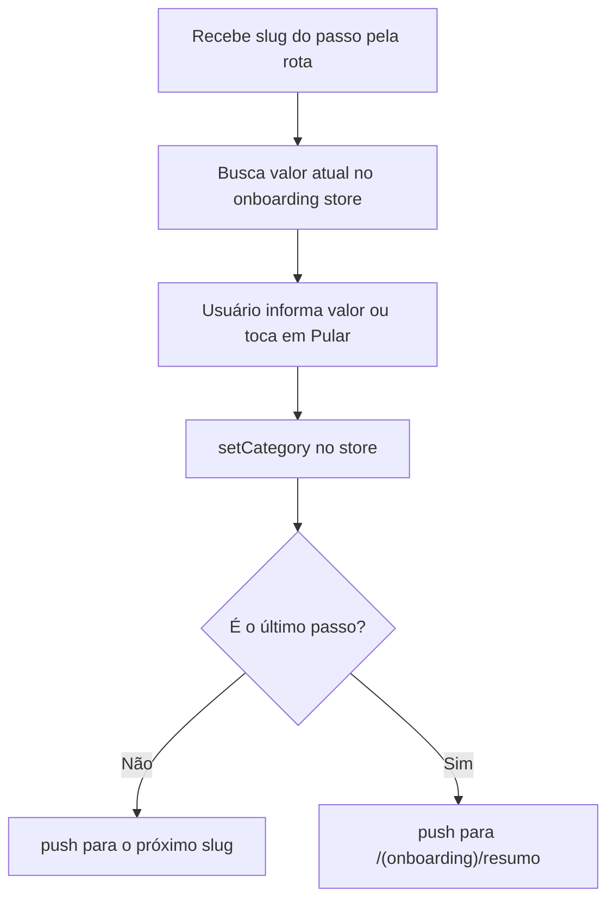
```mermaid
flowchart TD
  A["Recebe slug do passo pela rota"] --> B["Busca valor atual no onboarding store"]
  B --> C["Usuário informa valor ou toca em Pular"]
  C --> D["setCategory no store"]
  D --> E{"É o último passo?"}
  E -->|Não| F["push para o próximo slug"]
  E -->|Sim| G["push para /(onboarding)/resumo"]
```

### Resumo do orçamento (`app/(onboarding)/resumo.tsx`)

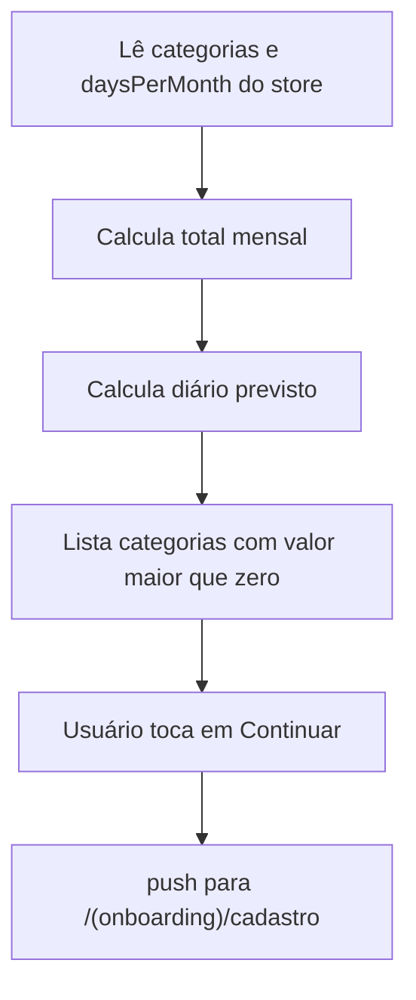
```mermaid
flowchart TD
  A["Lê categorias e daysPerMonth do store"] --> B["Calcula total mensal"]
  B --> C["Calcula diário previsto"]
  C --> D["Lista categorias com valor maior que zero"]
  D --> E["Usuário toca em Continuar"]
  E --> F["push para /(onboarding)/cadastro"]
```

### Cadastro (`app/(onboarding)/cadastro.tsx`)

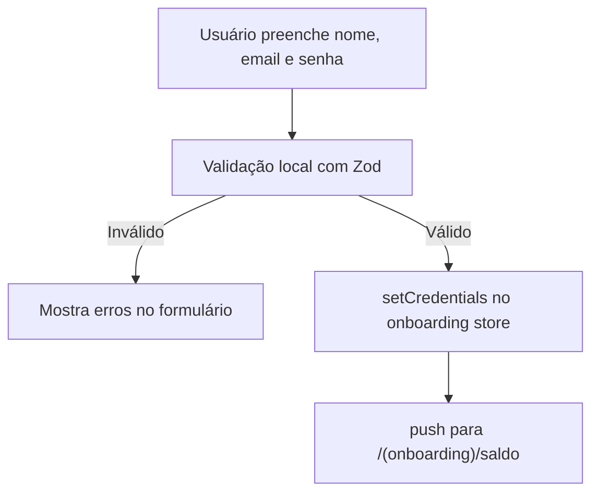
```mermaid
flowchart TD
  A["Usuário preenche nome, email e senha"] --> B["Validação local com Zod"]
  B -->|Inválido| C["Mostra erros no formulário"]
  B -->|Válido| D["setCredentials no onboarding store"]
  D --> E["push para /(onboarding)/saldo"]
```

### Saldo inicial e registro (`app/(onboarding)/saldo.tsx`)

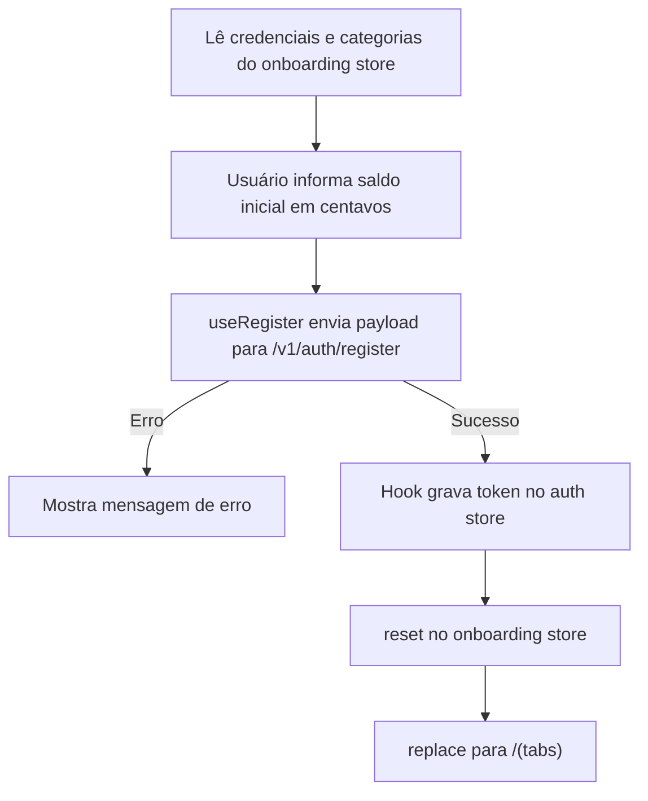
```mermaid
flowchart TD
  A["Lê credenciais e categorias do onboarding store"] --> B["Usuário informa saldo inicial em centavos"]
  B --> C["useRegister envia payload para /v1/auth/register"]
  C -->|Erro| D["Mostra mensagem de erro"]
  C -->|Sucesso| E["Hook grava token no auth store"]
  E --> F["reset no onboarding store"]
  F --> G["replace para /(tabs)"]
```

### Login (`app/(auth)/login.tsx`)

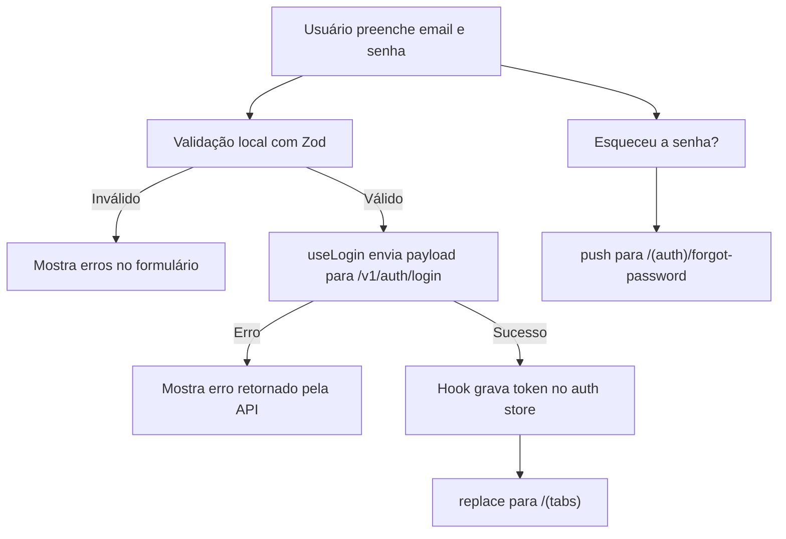
```mermaid
flowchart TD
  A["Usuário preenche email e senha"] --> B["Validação local com Zod"]
  B -->|Inválido| C["Mostra erros no formulário"]
  B -->|Válido| D["useLogin envia payload para /v1/auth/login"]
  D -->|Erro| E["Mostra erro retornado pela API"]
  D -->|Sucesso| F["Hook grava token no auth store"]
  F --> G["replace para /(tabs)"]
  A --> H["Esqueceu a senha?"]
  H --> I["push para /(auth)/forgot-password"]
```

### Recuperação de senha (`app/(auth)/forgot-password.tsx`)

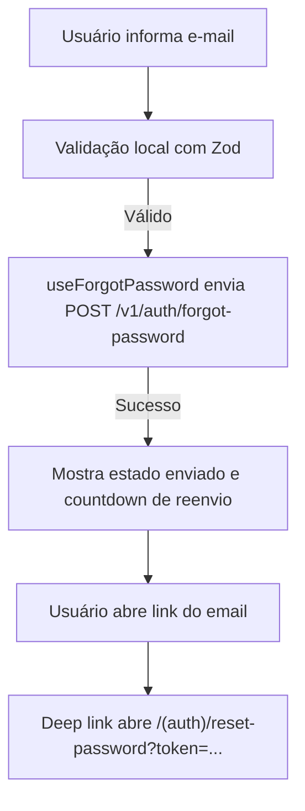
```mermaid
flowchart TD
  A["Usuário informa e-mail"] --> B["Validação local com Zod"]
  B -->|Válido| C["useForgotPassword envia POST /v1/auth/forgot-password"]
  C -->|Sucesso| D["Mostra estado enviado e countdown de reenvio"]
  D --> E["Usuário abre link do email"]
  E --> F["Deep link abre /(auth)/reset-password?token=..."]
```

### Nova senha (`app/(auth)/reset-password.tsx`)

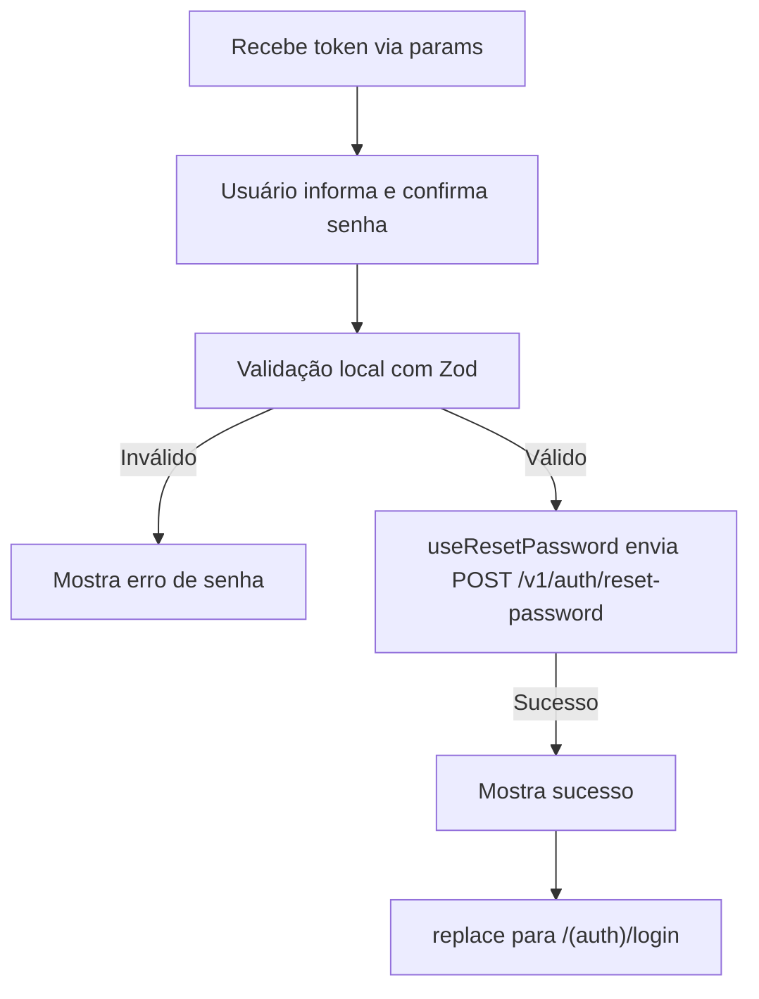
```mermaid
flowchart TD
  A["Recebe token via params"] --> B["Usuário informa e confirma senha"]
  B --> C["Validação local com Zod"]
  C -->|Inválido| D["Mostra erro de senha"]
  C -->|Válido| E["useResetPassword envia POST /v1/auth/reset-password"]
  E -->|Sucesso| F["Mostra sucesso"]
  F --> G["replace para /(auth)/login"]
```

### Container das abas (`app/(tabs)/_layout.tsx`)

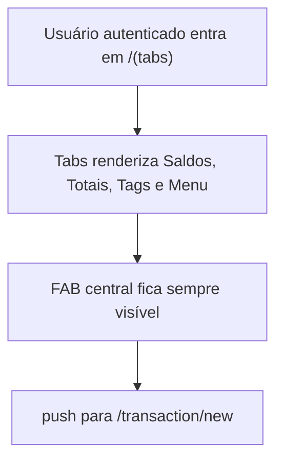
```mermaid
flowchart TD
  A["Usuário autenticado entra em /(tabs)"] --> B["Tabs renderiza Saldos, Totais, Tags e Menu"]
  B --> C["FAB central fica sempre visível"]
  C --> D["push para /transaction/new"]
```

### Saldos do mês (`app/(tabs)/index.tsx`)

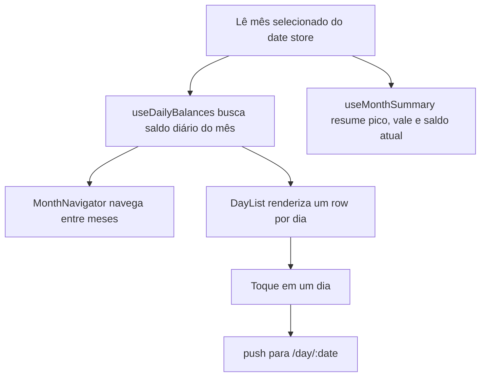
```mermaid
flowchart TD
  A["Lê mês selecionado do date store"] --> B["useDailyBalances busca saldo diário do mês"]
  A --> C["useMonthSummary resume pico, vale e saldo atual"]
  B --> D["MonthNavigator navega entre meses"]
  B --> E["DayList renderiza um row por dia"]
  E --> F["Toque em um dia"]
  F --> G["push para /day/:date"]
```

### Totais (`app/(tabs)/totais.tsx`)

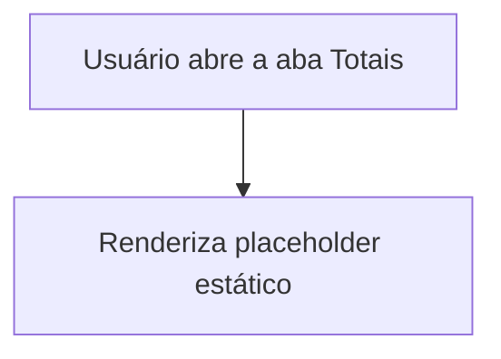
```mermaid
flowchart TD
  A["Usuário abre a aba Totais"] --> B["Renderiza placeholder estático"]
```

### Tags (`app/(tabs)/tags.tsx`)

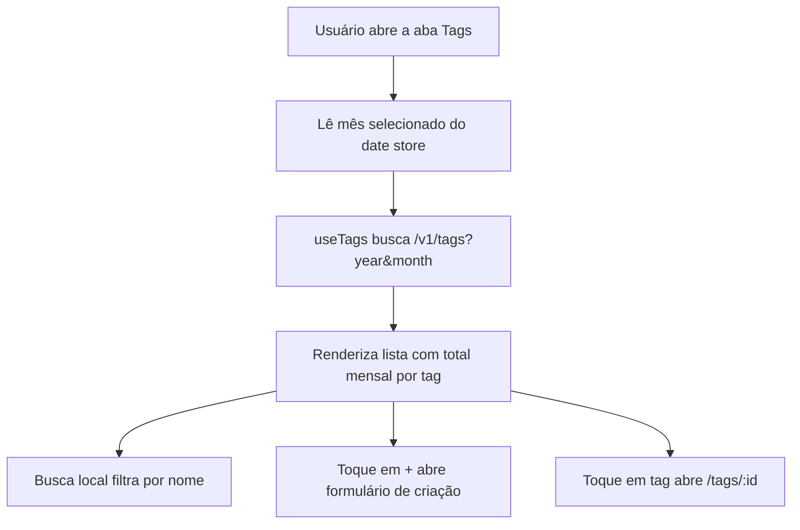
```mermaid
flowchart TD
  A["Usuário abre a aba Tags"] --> B["Lê mês selecionado do date store"]
  B --> C["useTags busca /v1/tags?year&month"]
  C --> D["Renderiza lista com total mensal por tag"]
  D --> E["Busca local filtra por nome"]
  D --> F["Toque em + abre formulário de criação"]
  D --> G["Toque em tag abre /tags/:id"]
```

### Detalhe da tag (`app/tags/[id].tsx`)

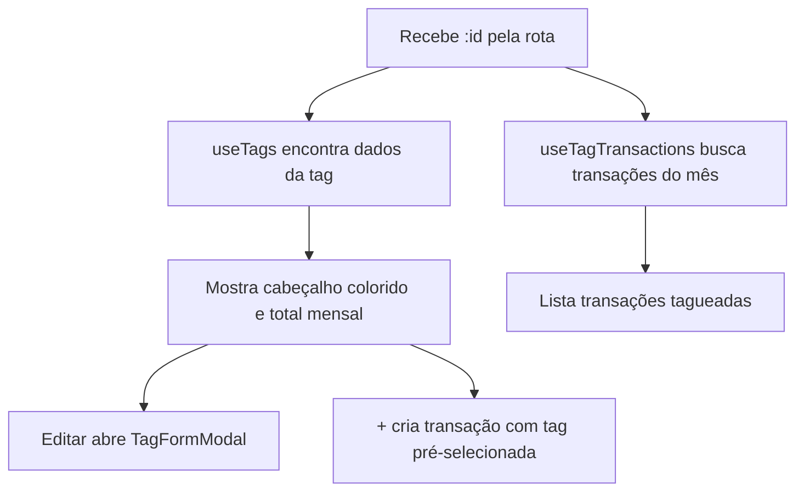
```mermaid
flowchart TD
  A["Recebe :id pela rota"] --> B["useTags encontra dados da tag"]
  A --> C["useTagTransactions busca transações do mês"]
  B --> D["Mostra cabeçalho colorido e total mensal"]
  C --> E["Lista transações tagueadas"]
  D --> F["Editar abre TagFormModal"]
  D --> G["+ cria transação com tag pré-selecionada"]
```

### Picker de tags (`app/tags/pick.tsx`)

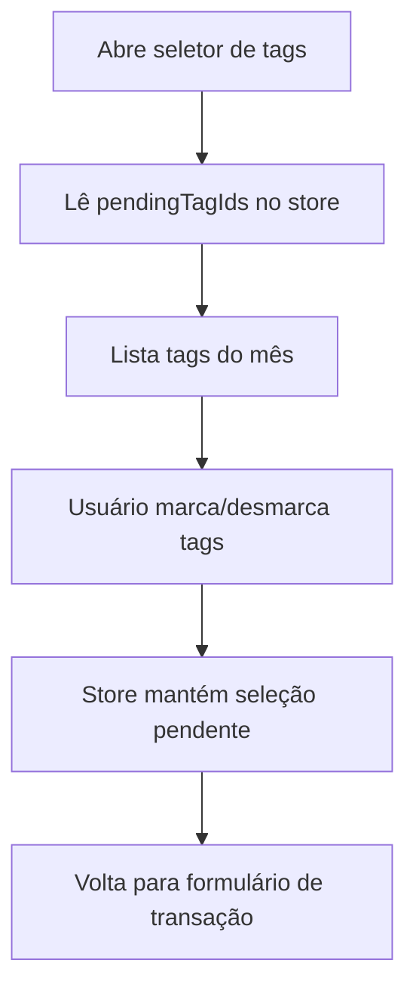
```mermaid
flowchart TD
  A["Abre seletor de tags"] --> B["Lê pendingTagIds no store"]
  B --> C["Lista tags do mês"]
  C --> D["Usuário marca/desmarca tags"]
  D --> E["Store mantém seleção pendente"]
  E --> F["Volta para formulário de transação"]
```

### Menu (`app/(tabs)/menu.tsx`)

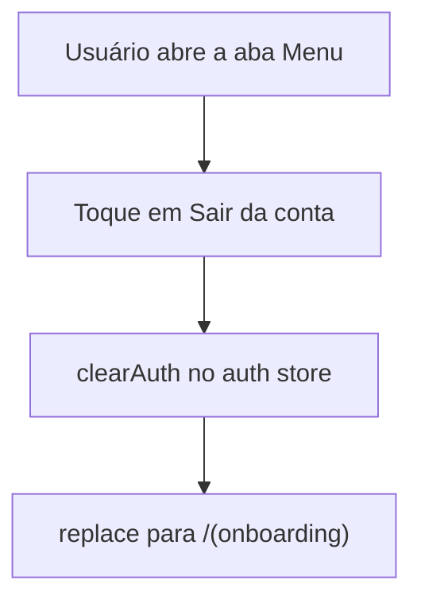
```mermaid
flowchart TD
  A["Usuário abre a aba Menu"] --> B["Toque em Sair da conta"]
  B --> C["clearAuth no auth store"]
  C --> D["replace para /(onboarding)"]
```

### Detalhe do dia (`app/day/[date].tsx`)

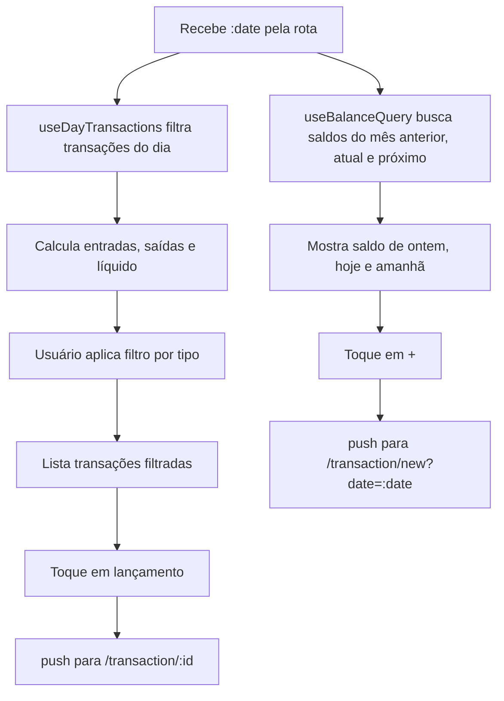
```mermaid
flowchart TD
  A["Recebe :date pela rota"] --> B["useDayTransactions filtra transações do dia"]
  A --> C["useBalanceQuery busca saldos do mês anterior, atual e próximo"]
  B --> D["Calcula entradas, saídas e líquido"]
  C --> E["Mostra saldo de ontem, hoje e amanhã"]
  D --> F["Usuário aplica filtro por tipo"]
  F --> G["Lista transações filtradas"]
  G --> H["Toque em lançamento"]
  H --> I["push para /transaction/:id"]
  E --> J["Toque em +"]
  J --> K["push para /transaction/new?date=:date"]
```

### Novo lançamento (`app/transaction/new.tsx`)

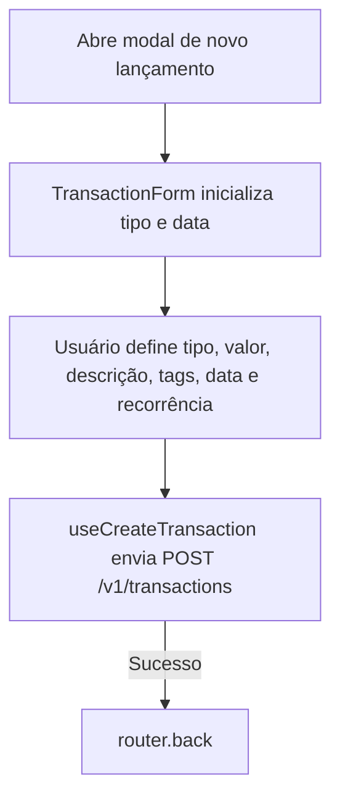
```mermaid
flowchart TD
  A["Abre modal de novo lançamento"] --> B["TransactionForm inicializa tipo e data"]
  B --> C["Usuário define tipo, valor, descrição, tags, data e recorrência"]
  C --> D["useCreateTransaction envia POST /v1/transactions"]
  D -->|Sucesso| E["router.back"]
```

### Editar lançamento (`app/transaction/[id].tsx`)

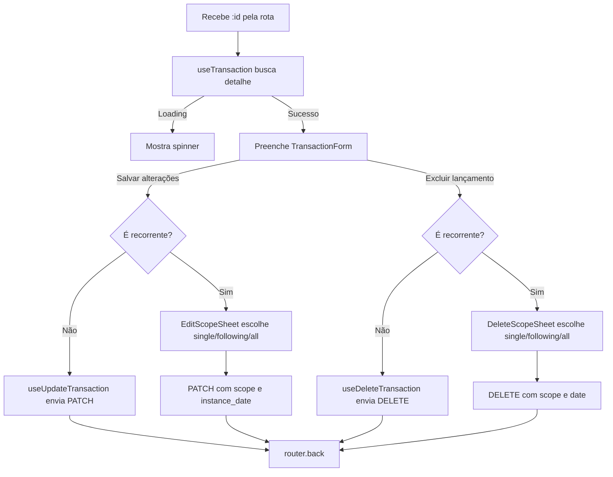
```mermaid
flowchart TD
  A["Recebe :id pela rota"] --> B["useTransaction busca detalhe"]
  B -->|Loading| C["Mostra spinner"]
  B -->|Sucesso| D["Preenche TransactionForm"]
  D -->|Salvar alterações| E{"É recorrente?"}
  E -->|Não| F["useUpdateTransaction envia PATCH"]
  E -->|Sim| G["EditScopeSheet escolhe single/following/all"]
  G --> H["PATCH com scope e instance_date"]
  D -->|Excluir lançamento| I{"É recorrente?"}
  I -->|Não| J["useDeleteTransaction envia DELETE"]
  I -->|Sim| K["DeleteScopeSheet escolhe single/following/all"]
  K --> L["DELETE com scope e date"]
  F --> M["router.back"]
  H --> M
  J --> M
  L --> M
```

## Dependências externas e para que servem

### Ativas na app principal

| Dependência                                                      | Papel observado no projeto                                           |
| ---------------------------------------------------------------- | -------------------------------------------------------------------- |
| `expo`, `react`, `react-native`, `react-dom`, `react-native-web` | Runtime principal e alvo mobile/web do app Expo.                     |
| `expo-router`                                                    | Navegação file-based e organização de rotas por grupos.              |
| `@tanstack/react-query`                                          | Cache de dados remotos, mutations e invalidação de queries.          |
| `axios`                                                          | Cliente HTTP com interceptors para auth e tratamento de erro.        |
| `zustand`                                                        | Estado local/global leve para auth, onboarding e data selecionada.   |
| `@react-native-async-storage/async-storage`                      | Persistência do token/auth e outras stores persistidas.              |
| `zod`                                                            | Validação de login e cadastro no cliente.                            |
| `date-fns`                                                       | Formatação de datas e navegação entre dias/meses.                    |
| `uniwind`, `tailwindcss`, `tailwind-merge`, `tailwind-variants`  | Styling utilitário, tokens e composição de variantes/classes.        |
| `heroui-native`                                                  | Provider global e primitives como toast e separator.                 |
| `lucide-react-native`                                            | Ícones do app.                                                       |
| `react-native-gesture-handler`                                   | Base de gestos necessária no root layout.                            |
| `react-native-safe-area-context`                                 | Insets e espaçamento seguro no topo/rodapé.                          |
| `react-native-screens`                                           | Infra de navegação/telas nativas usada pelo ecossistema Expo Router. |
| `react-native-reanimated`, `react-native-worklets`               | Animações do `CurrencyInput` e `TypeSelector`.                       |
| `react-native-svg`                                               | Suporte vetorial usado por bibliotecas de ícones/UI.                 |
| `expo-font`                                                      | Carregamento das fontes Inter e JetBrains Mono.                      |
| `expo-splash-screen`                                             | Mantém a splash screen até as fontes carregarem.                     |

### Ferramentas de desenvolvimento

| Dependência                               | Papel observado no projeto                      |
| ----------------------------------------- | ----------------------------------------------- |
| `typescript`                              | Tipagem estática com `strict: true`.            |
| `eslint`, `eslint-config-expo`            | Lint base do projeto Expo.                      |
| `oxlint`                                  | Lint adicional rápido no script `bun run lint`. |
| `prettier`, `prettier-plugin-tailwindcss` | Formatação e ordenação de classes utilitárias.  |
| `@types/react`                            | Tipos do React para TypeScript.                 |

### Dependências mantidas sem import direto no app principal

| Dependência                      | Situação observada                                                                 |
| -------------------------------- | ---------------------------------------------------------------------------------- |
| `expo-constants`, `expo-linking` | Mantidas explicitamente porque `expo-router` ainda as trata como peers de runtime. |
